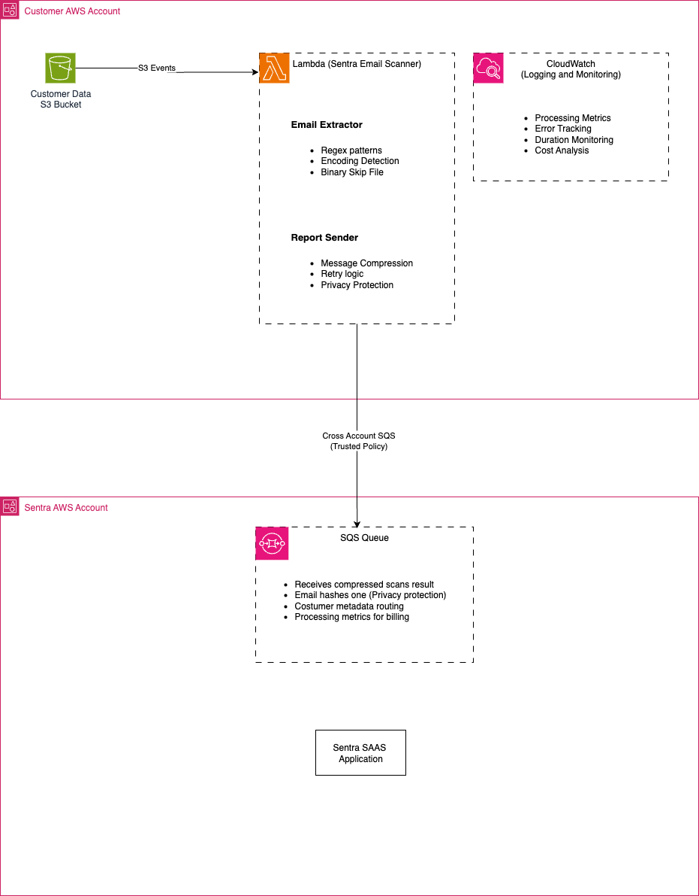

# Sentra Email Scanner
## Enterprise-Grade Email Detection for AWS S3 Buckets

  

### Solutions Architecture Overview

This project demonstrates enterprise-grade Solutions Architecture thinking with a focus on **security**, **scalability**, and **operational excellence**. The Sentra Email Scanner is designed as a secure, event-driven system that scans S3 objects for email addresses while maintaining strict privacy and security standards.

## Architecture Decisions & Justifications

### 1. **Compute Infrastructure Choice: AWS Lambda** ✅

**Selected: AWS Lambda**
- ✅ **Event-driven**: Perfect for S3 file processing triggers
- ✅ **Serverless**: No infrastructure management overhead
- ✅ **Cost-effective**: Pay only for execution time
- ✅ **Built-in retry**: Automatic error handling and retries
- ✅ **Scalability**: Automatic scaling based on S3 events
- ✅ **Integration**: Native S3 event integration

**Alternative Considered: EC2/ECS**
- ❌ **Infrastructure overhead**: Requires server management
- ❌ **Cost inefficient**: Always-running instances for sporadic workloads
- ❌ **Scaling complexity**: Manual scaling configuration needed

### 2. **Communication Architecture: SQS + Lambda (Push Model)** ✅

**Selected: SQS + Cross-account messaging**
- ✅ **Isolation**: Strong security boundary between customer and Sentra
- ✅ **Reliability**: Message durability and retry mechanisms
- ✅ **Async processing**: Non-blocking operation
- ✅ **Monitoring**: Built-in CloudWatch metrics
- ✅ **Cost optimization**: Pay per message

**Alternatives Considered:**
- **Option B**: S3 + Cross-account access (Pull model)
  - Better for large result sets but requires ongoing access
- **Option C**: API Gateway + Lambda (Synchronous)
  - Good for real-time but less reliable for large volumes

### 3. **Security & IAM Design** 🔐

#### Least Privilege Access
```hcl
# Customer Lambda Role - Minimal S3 permissions
resource "aws_iam_policy" "lambda_s3_policy" {
  policy = jsonencode({
    Statement = [{
      Effect = "Allow"
      Action = [
        "s3:GetObject",
        "s3:GetObjectVersion"
      ]
      Resource = "arn:aws:s3:::${var.s3_bucket_name}/*"
    }]
  })
}
```

#### Cross-Account Security
- **External ID requirement** for role assumption
- **Specific Sentra account ID** verification
- **Time-limited access tokens**

#### Data Privacy
- **Email hashing**: Only SHA-256 hashes transmitted, never plaintext
- **Compression**: Message compression for efficiency
- **Audit logging**: Complete CloudWatch audit trail

## System Architecture Diagram




## File Classification Algorithm

The scanner implements intelligent file processing with multiple security and cost considerations:

```python
def classify_file(file_key, file_size):
    """
    Multi-layered classification strategy:
    1. Extension whitelist (.txt, .csv, .json, .log, .md)
    2. File size limits (default: 100MB max)
    3. Binary detection (skip images, videos, executables)
    4. Cost estimation for monitoring
    """
```

### Classification Flow:
1. **Security Layer**: Extension whitelist prevents processing of executables
2. **Cost Layer**: Size limits prevent expensive large file processing
3. **Efficiency Layer**: Binary detection avoids processing non-text files
4. **Monitoring Layer**: Cost estimation for operational visibility

## Quick Start Deployment

### Prerequisites
- Access to AWS CloudShell
- Access to  GitHub Repository

### 1. Go to Project directory
```bash
cd xtoro-challenge
```

### 2. Deploy Infrastructure
```bash
bash scripts/deploy.sh deploy -e <environment_name> -c <customer_name> -b <your_bucket_to_scan> -q <queue_arn> -a <sentra_account_id>  
```

### 3. Test Installation
```bash
# Upload test file to trigger scan
echo "Contact us at test@example.com" > test-email.txt
aws s3 cp test-email.txt s3://your-bucket-to-scan/

# Monitor CloudWatch logs
aws logs tail /aws/lambda/your-company-sentra-scanner --follow
```


### 4. Destroy Installation
```bash
bash scripts/deploy.sh destory -e <environment_name> -c <customer_name> -b <your_bucket_to_scan> -q <queue_arn> -a <sentra_account_id>  
```


### 5. Validate Requirements (Optional)
```bash
bash scripts/deploy.sh validate -e <environment_name> -c <customer_name> -b <your_bucket_to_scan> -q <queue_arn> -a <sentra_account_id>  
```


### 5. Rerun Scans (Optional)
```bash
bash scripts/deploy.sh estimate -e <environment_name> -c <customer_name> -b <your_bucket_to_scan> -q <queue_arn> -a <sentra_account_id>  
```

## Operational Excellence

### Monitoring & Alerting
- **Custom CloudWatch Metrics**: Processing time, emails found, error rates
- **Automated Alarms**: Error thresholds, duration warnings
- **Cost Tracking**: Per-file processing cost estimation

### Error Handling Strategy
```python
def process_s3_object(bucket, key):
    try:
        # Core processing logic
        pass
    except ClientError as e:
        if e.response['Error']['Code'] == 'NoSuchKey':
            # Handle race condition: file deleted during processing
        elif e.response['Error']['Code'] == 'AccessDenied':
            # Handle permission issues gracefully
        # Additional error handling...
```

### Resilience Patterns
- **Exponential backoff** for SQS message sending
- **Dead letter queues** for failed processing
- **Graceful degradation** for temporary AWS service issues

## Security Features

### Data Protection
- **Encryption at rest**: S3 bucket encryption enabled
- **Encryption in transit**: HTTPS/TLS for all communications
- **Email privacy**: Only SHA-256 hashes transmitted

### Access Control
- **IAM least privilege**: Minimal required permissions only
- **Cross-account isolation**: Secure boundary between customer and Sentra
- **Audit trail**: Complete CloudWatch logging

### Compliance Considerations
- **GDPR compliance**: No PII stored or transmitted
- **SOC 2 alignment**: Audit logging and access controls
- **HIPAA considerations**: Email hashing for healthcare environments

## Cost Optimization

### Lambda Optimization
- **Right-sized memory**: 512MB default (configurable)
- **Efficient processing**: Binary file detection to skip unnecessary work
- **File size limits**: Prevent expensive large file processing

### S3 Intelligent Tiering Awareness
The scanner is designed to work efficiently with S3 Intelligent Tiering:
- **Glacier awareness**: Handles `RestoreInProgress` status
- **Restoration triggers**: Can trigger restore for archived objects
- **Cost monitoring**: Tracks restoration costs

## Testing Strategy

```bash
# Run unit tests
python -m pytest tests/ -v

# Test email extraction patterns
python -c "
from src.email_extractor import EmailExtractor
extractor = EmailExtractor({'customer_name': 'test'})
result = extractor.extract_from_text('Contact: test@example.com')
print(f'Found {len(result[\"emails\"])} emails')
"

# Test file classification
python -c "
from src.scanner import SentraScanner
import os
os.environ.update({
    'SENTRA_SQS_QUEUE_URL': 'test-queue',
    'CUSTOMER_NAME': 'test',
    'ENVIRONMENT': 'test'
})
scanner = SentraScanner()
result = scanner.classify_file('bucket', 'test.txt', 1000)
print(f'Should process: {result[\"should_process\"]}')
"
```


## Scaling Considerations

### Current Capacity
- **Concurrent executions**: 1000 (Lambda default)
- **File size limit**: 100MB (configurable)
- **Processing rate**: ~1000 files/minute

### Scale-Up Path
1. **Increase concurrency**: Request limit increase from AWS
2. **Batch processing**: Implement batch file processing for high volume
3. **Multi-region**: Deploy to multiple regions for global scale
4. **Stream processing**: Move to Kinesis for real-time processing

## 📞 Integration with Sentra Platform

### Message Format
```json
{
  "message_metadata": {
    "version": "1.0",
    "message_type": "email_scan_results",
    "customer_info": {
      "customer_name": "acme-corp",
      "environment": "production"
    }
  },
  "scan_data": {
    "email_analysis": {
      "total_emails_found": 15,
      "unique_domains": 3,
      "email_hashes": ["sha256hash1", "sha256hash2"],
      "domain_summary": [
        {"domain": "company.com", "count": 12},
        {"domain": "external.org", "count": 3}
      ]
    }
  }
}
```

### Privacy Protection
- **No plaintext emails**: Only SHA-256 hashes transmitted
- **Metadata only**: File paths and processing metrics
- **Compressed transmission**: Gzip compression for efficiency

# Resources
[Architecture Decisions] [docs/architecture-decisions.md]
[Operations Runbook] [docs/operations-runbook.md]